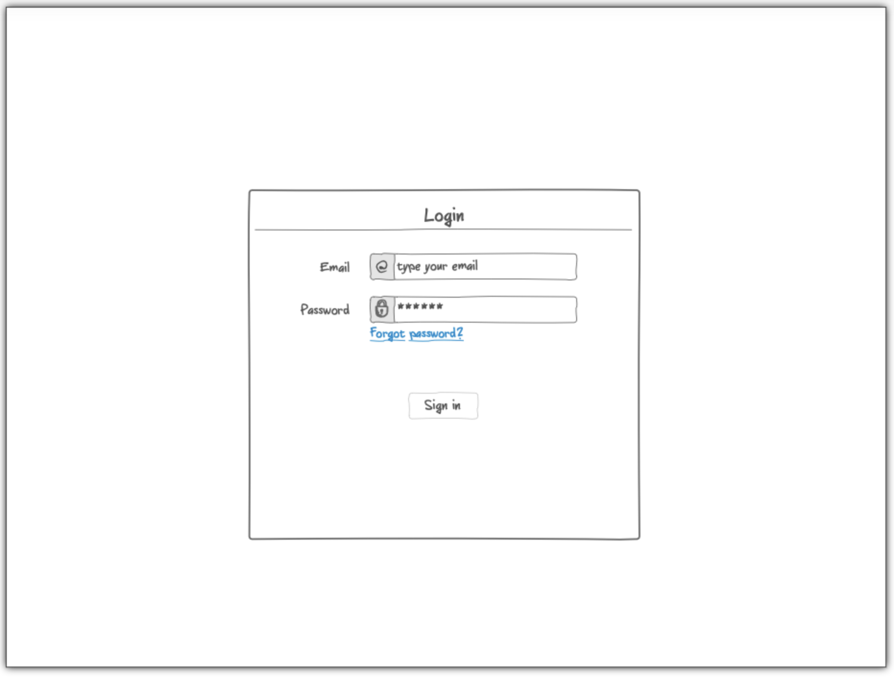
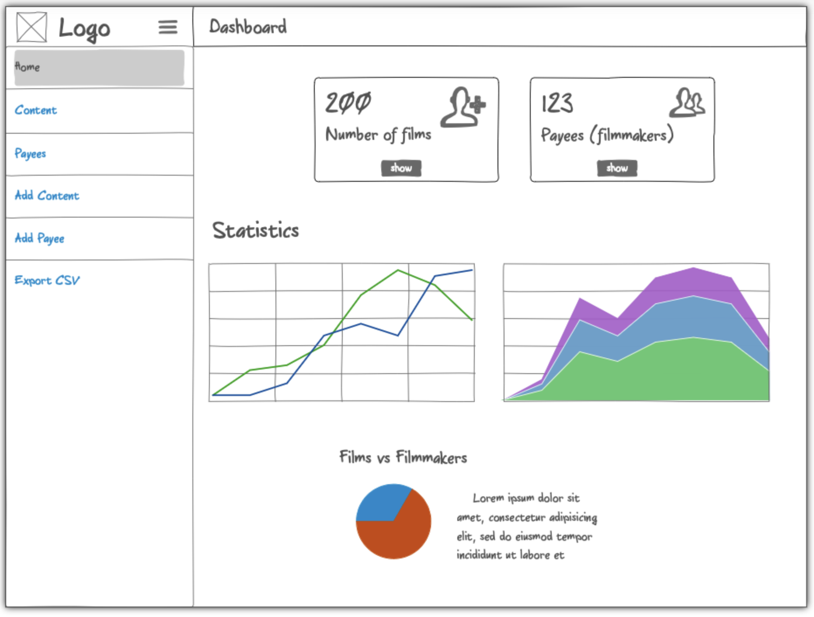
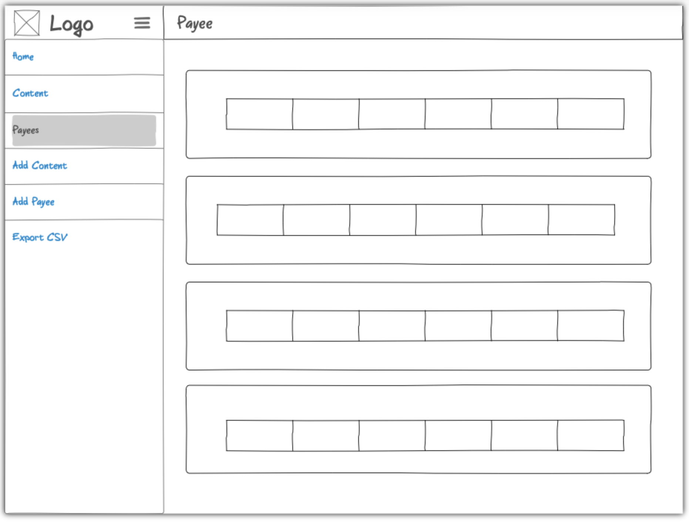
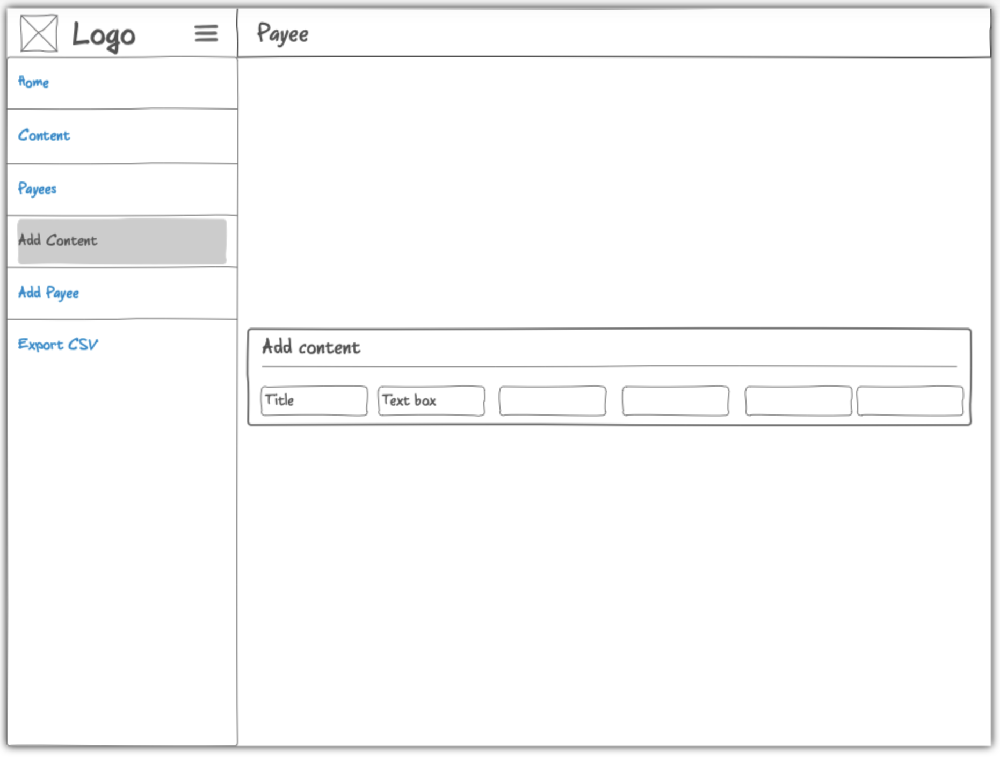
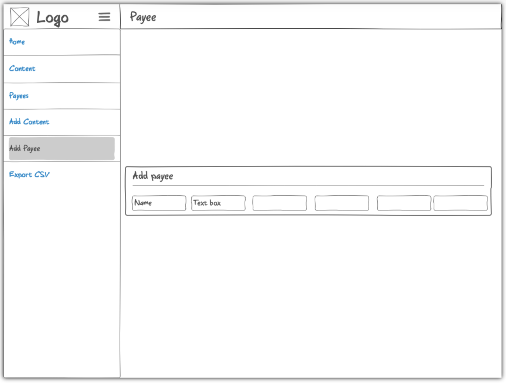

# Startup Specification

## Elevator Pitch
Imagine this: Hollywood. Flashing Lights. Fancy cars. Ryan Reynolds walking down your red carpet. Spontaneous Mint Mobile Ad... It's premier night at your film festival and streaming service in the home of the stars. Your theater is packed and all is well. The movies come and go, but then you see Ryan Reynolds walk away with his head down at the end of the night. You run to ask him if he's alright and he replies: "My film never made it on screen, and I can't even watch it on the app 😞." How could this happen!?! 

We know! You run your entire business from a set of ever growing Google Spreadsheets.

Well how do you fix it...?

First off, give Ryan Reynolds a hug he definitely needs it. Then subscribe to the Film Festival Almanac! This web application allows you to track and manage your films, their associated information, and filmmakers through an interactive database. Easily add, remove, export and condense your spreadsheets into a user friendly application!

## Design

The design for the website and its pages can be found at the following [link](https://ninjamock.com/s/29L9TLx).

## Key Features
- Secure login
- Ability to add and store information about content and its creators to a database through the website
- Interact with the information that the user has uploaded
- Export a CSV (download it) with necessary information

## Technology

- HTML
    - Use HTML to structure the application. There will be six pages. A Login, Dashboard, Content View, Payee View, Add Content, and Add Payee page.

- CSS 
    - Make the application look good

- JavaScript
    - Provides the login, updating the database, pulling from the database calls

- DB
    - Stores the users, content information, and payee information. Can't use the application without signing in.

- WebSocket
    - Updates the statistics displayed on the dashboard based on the information uploaded to the database.

##### Side Note

A small film festival and streaming service reached out to me to make an application like this for them. I attempted to use my CS240 skills to put together a Java application and it did not turn out the greatest. My intentions for this class are to learn and make something that is presentable and functioning. Any feedback would be greatly appreciated :)

# Startup CSS

For this assignment I styled the following:

- Header, Footer and the main content body.
- I removed lines that made up the nav bar and added in a proper navbar using Bootstrap.
- I did my best to make my application responsive to the resizing of the window.
- Tried to make tables have good contrast for readability.
- Consistent fonts across the webapplication.

# Startup JavaScript

This application currently works for a single user. There are placeholders for future technologies.

- login: Then you login it takes you to the homepage. The username is displayed across the site until you log out.
- database: Displays the current films and people who are paid for them (payees) are displayed. This is currently done using local storage
- websocket data: Randomly adds a payee to the database to simulate another user updating the database simultaneously, until websocket is implemented
- application logic: The user is able to add to the innteractive database as they find fit.

# Startup Service

For this assignment I added backend endpoints that receive data (content and payee) and returns them onto the database tables.

- Node.js/Express HTTP service: done
- Static middleware for frontend: done
- Third party endpoint: added in a quote, but this does not contribute valuable functionality to the interactive database and will subsequently be removed in further iterations.
- Backend provides service endpoints: endpoints allow for data to be added and returned
- Frontend calls service endpoints: Frontend uses implemented service enpoints to add information
